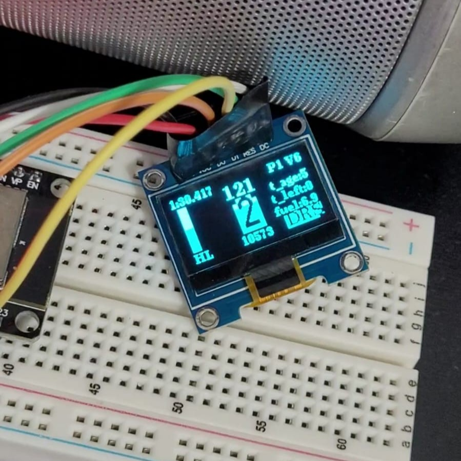
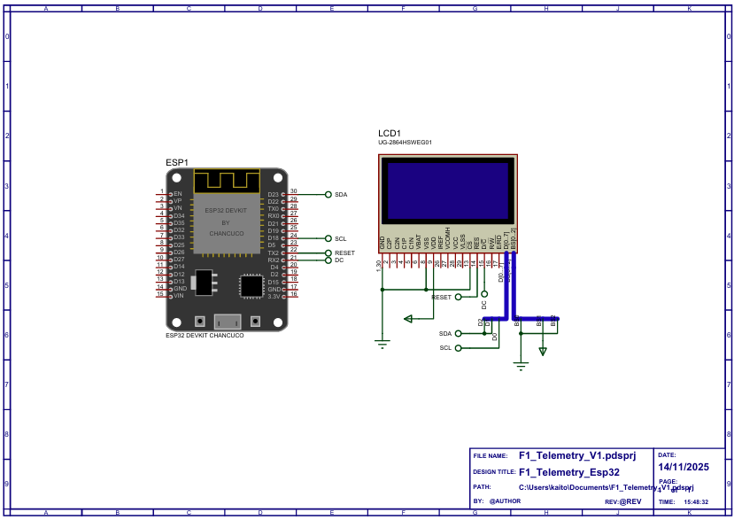

# Projeto de Telemetria F1 25 com ESP32 e FreeRTOS

**SEL0337 - PROJETOS EM SISTEMAS EMBARCADOS**
**Prática 6: Introdução aos Sistemas Operacionais de Tempo Real (RTOS)**
**Prática 5: Controle de Versão com Git e GitHub**

- **Aluno:** Gabriel Breda Coelho
- **Nº USP:** 14746360
- **Aluno:** Heitor Kaito Oumura
- **Nº USP:** 13828101

---

## 1. Resumo do Projeto

Este projeto consiste em um dashboard de telemetria em tempo real para o simulador F1 25, desenvolvido com um microcontrolador ESP32 e um display OLED 0.96".

O sistema conecta-se à rede Wi-Fi para interceptar pacotes UDP enviados pelo jogo e exibe informações críticas para o piloto. O projeto é o usa FreeRTOS para garantir a integridade dos dados e a implementação de um algoritmo de "Limpeza de Fila" (Anti-Lag) que assegura latência zero na exibição.

### Funcionalidades do Display
* **Velocidade e Marcha:** Com indicação visual de troca de marcha (fundo invertido) baseada no RPM e sinalizadores visuais do jogo.
* **RPM:** Valor numérico em tempo real.
* **ERS (Bateria):** Barra gráfica de nível e modo de uso de energia (MED, HL, OVT).
* **Combustível:** Estimativa de voltas restantes.
* **Pneus:** Idade do pneu atual e vida útil restante.
* **Tempos:** Tempo da última volta.
* **DRS:** Indicador visual quando a asa móvel está disponível/ativa.

---

## 2. Arquitetura de Software e RTOS

O sistema utiliza o FreeRTOS para gerenciar duas tarefas concorrentes em núcleos distintos do ESP32, otimizando o processamento paralelo.

### Tarefas (Tasks)
1.  **`vTask_TelemetryUDP` (Core 1 - Prioridade 5):**
    * Responsável pela recepção de pacotes UDP.
    * **Estratégia Anti-Lag:** Implementa um loop que processa todos os pacotes acumulados no buffer de rede antes de ceder tempo à CPU. Isso evita o "efeito fila" e garante que o dado exibido seja sempre o mais recente.
    * Utiliza Timestamp (`millis()`) para marcar a chegada de dados críticos, permitindo identificar se a conexão caiu ou se o jogo foi pausado.

2.  **`vTask_DisplayOLED` (Core 0 - Prioridade 1):**
    * Responsável pela atualização do display OLED.
    * Roda a uma taxa fixa de **60Hz (16ms)** utilizando `vTaskDelayUntil` para garantir fluidez visual sem consumir recursos desnecessários.
    * Verifica a "idade" dos dados (timestamp) para apagar indicadores (como a luz de troca de marcha) caso o jogo pare de enviar dados por mais de 100ms.

### Sincronização (Mutex)
Foi utilizado um Semáforo Mutex (`g_TelemetryMutex`) para proteger a estrutura de dados global `g_Telemetry`.
* A tarefa de rede (Alta Prioridade) adquire o Mutex para **escrever** os dados novos.
* A tarefa de display (Baixa Prioridade) adquire o Mutex para **ler** os dados e fazer uma cópia local.
* Isso garante a **atomicidade** das operações e previne condições de corrida (leitura de dados corrompidos).

---

## 3. Diagrama e Montagem

A montagem utiliza um ESP32 DevKit V1 comunicando-se com um display OLED SSD1306 via protocolo SPI (para maior velocidade que o I2C).

### Pinagem (SPI)
* **SCK (Clock):** GPIO 18
* **MOSI (Data):** GPIO 23
* **RES (Reset):** GPIO 17
* **DC (Data/Command):** GPIO 16
* **CS (Chip Select):** GPIO 5

### Fotos do Projeto

---

## 4. Diferença: Tasks (RTOS) vs. Threads (Linux)

* **Determinismo:** No FreeRTOS, o escalonador garante que a tarefa de maior prioridade (UDP) rode imediatamente quando necessário, garantindo o cumprimento de prazos (Hard/Firm Real-Time). No Linux (OS de propósito geral), o escalonador foca em *throughput* médio, sem garantias estritas de tempo de resposta.
* **Gerenciamento:** As Tasks do FreeRTOS são extremamente leves e rodam em um único espaço de endereçamento de memória, permitindo troca de contexto muito rápida, essencial para microcontroladores.

---

## 5. Como Executar

1.  Configure o Wi-Fi (SSID/Senha) no arquivo `main.cpp`.
2.  No jogo **F1 25**, configure a Telemetria UDP:
    * **IP:** (Endereço IP mostrado no display ao ligar o ESP32)
    * **Porta:** 20777
    * **Taxa:** 60Hz
    * **Formato:** 2025
3.  Compile e faça o upload na placa ESP32 via PlatformIO.
