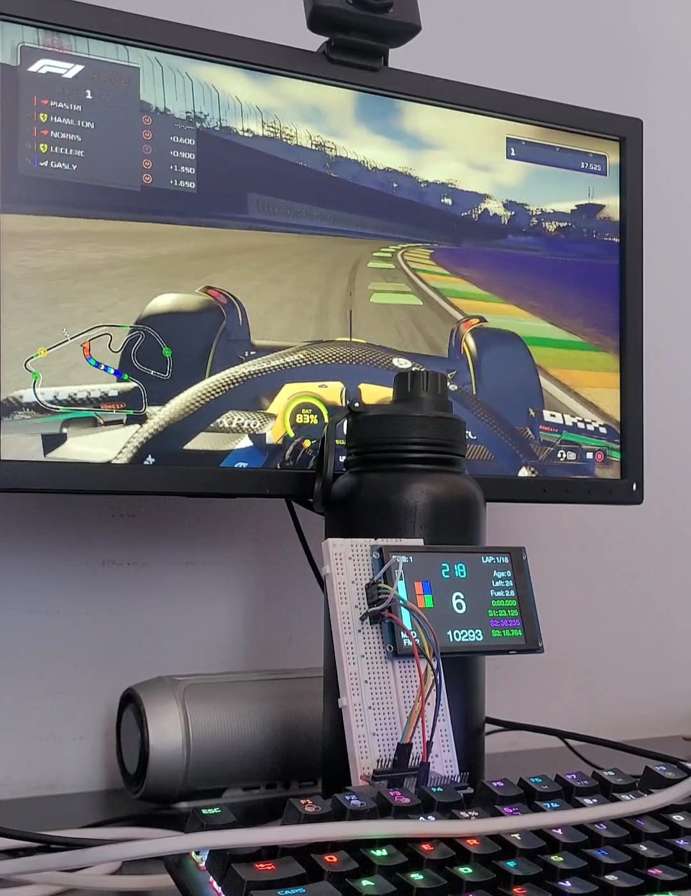

# Projeto de Telemetria F1 25 com ESP32 e FreeRTOS

**SEL0337 - PROJETOS EM SISTEMAS EMBARCADOS**
**Prática 6: Introdução aos Sistemas Operacionais de Tempo Real (RTOS)**
**Prática 5: Controle de Versão com Git e GitHub**

- **Aluno:** Gabriel Breda Coelho
- **Nº USP:** 14746360
- **Aluno:** Heitor Kaito Oumura
- **Nº USP:** 13828101

---

## 1. Resumo do Projeto

Este projeto consiste em um dashboard de telemetria profissional para o simulador F1 25, desenvolvido em um microcontrolador ESP32. Este projeto utiliza um display TFT LCD de 3.5" colorido para exibir dados de engenharia e pilotagem em tempo real.

O sistema conecta-se à rede Wi-Fi para interceptar pacotes UDP enviados pelo jogo e exibe informações críticas para o piloto. O projeto é o usa FreeRTOS para garantir a integridade dos dados e a implementação de um algoritmo de "Limpeza de Fila" (Anti-Lag) que assegura latência zero na exibição.

### Funcionalidades do Display
### Dados de Pilotagem
* **Marcha Central:** Indicador com lógica de inversão de cor (Fundo Vermelho/Texto Preto) no momento exato da troca de marcha, sincronizado com os LEDs do volante dentro do simulador.
* **Velocidade & RPM:** Atualização em tempo real.
* **DRS (Drag Reduction System):** Indicador inteligente com dois estados:
    * *Contorno Laranja:* DRS Disponível (Zona de ativação).
    * *Fundo Verde:* DRS Ativo (Asa aberta).

### Estratégia e Engenharia
* **Pneus Térmicos:** 4 barras independentes que mostram visualmente:
    * *Desgaste:* A barra diminui conforme a vida útil do pneu cai (lógica de "bateria").
    * *Temperatura:* A cor muda dinamicamente (Azul = Frio, Verde = Ideal, Vermelho = Superaquecimento).
* **ERS (Bateria):** Barra gráfica de nível e modo da bateria (MED, HOT, OVT).
* **Combustível:** Indicador de voltas restantes e da mistura (Fuel Mix).

### Alertas de Pista
* **Safety Car (SC/VSC):** Quando um Safety Car é acionado, o dashboard muda para um modo de **"Overlay de Prioridade"**, cobrindo a tela com um fundo colorido e mostrando apenas o delta (diferença de tempo) que o piloto deve manter.
* **Setores:** Comparação em tempo real dos tempos de setor (S1, S2, S3) com o melhor tempo pessoal da sessão (Verde/Vermelho).

---

## 2. Arquitetura de Software e RTOS

O sistema utiliza o FreeRTOS para gerenciar duas tarefas concorrentes em núcleos distintos do ESP32, otimizando o processamento paralelo.

### Tarefas (Tasks)
1.  **`vTask_TelemetryUDP` (Core 1 - Prioridade 5):**
    * Responsável pela recepção de pacotes UDP.
    * **Estratégia Anti-Lag:** Implementação de um loop que processa todos os pacotes acumulados no buffer de rede antes de ceder tempo à CPU. Isso evita o "efeito fila" e garante que o dado exibido seja sempre o mais recente.
    * Utiliza Timestamp (`millis()`) para marcar a chegada de dados críticos, permitindo identificar se a conexão caiu ou se o jogo foi pausado.

2.  **`vTask_DisplayOLED` (Core 0 - Prioridade 1):**
    * Responsável pela atualização do display LCD.
    * Devido ao tempo de desenho do LCD, o *Task Watchdog Timer* do ESP32 tendia a reiniciar o sistema. Implementamos uma gestão manual do WDT (`esp_task_wdt_reset`) em pontos estratégicos do loop de renderização para garantir estabilidade sem travar o processador.
    * Verifica a "idade" dos dados (timestamp) para apagar indicadores (como a luz de troca de marcha) caso o jogo pare de enviar dados por mais de 100ms.

### Sincronização (Mutex)
Foi utilizado um Semáforo Mutex (`g_TelemetryMutex`) para proteger a estrutura de dados global `g_Telemetry`.
* A tarefa de rede (Alta Prioridade) adquire o Mutex para **escrever** os dados novos.
* A tarefa de display (Baixa Prioridade) adquire o Mutex para **ler** os dados e fazer uma cópia local.
* Isso garante a atomicidade das operações e previne condições de corrida (leitura de dados corrompidos).

---

## 3.  Hardware e Conexões

* **Microcontrolador:** ESP32 DevKit V1
* **Display:** 3.5" TFT LCD (Driver ST7796S)
* **Protocolo:** SPI

### Pinagem (SPI VSPI)
Pino LCD -> Pino ESP32 
VCC -> VIN
BL -> VIN
GND -> GND
CS -> GPIO5
RESET -> GPIO17
DC -> GPIO16
MOSI -> GPIO23
SCK -> GPIO18

### Fotos do Projeto

---

## 4. Diferença: Tasks (RTOS) vs. Threads (Linux)

* **Determinismo:** No FreeRTOS, o escalonador garante que a tarefa de maior prioridade (UDP) rode imediatamente quando necessário, garantindo o cumprimento de prazos (Hard/Firm Real-Time). No Linux (OS de propósito geral), o escalonador foca em throughput médio, sem garantias estritas de tempo de resposta.
* **Gerenciamento:** As Tasks do FreeRTOS são extremamente leves e rodam em um único espaço de endereçamento de memória, permitindo troca de contexto muito rápida, essencial para microcontroladores.

---

## 5. Como Executar

O projeto conta com um Portal de Configuração (WiFiManager), permitindo que funcione em qualquer rede Wi-Fi sem mudar o código.

1.  **Primeiro Uso:** Ao ligar, se o ESP32 não encontrar uma rede conhecida, ele criará um Ponto de Acesso WIFI chamado "F1_Dashboard_Setup".
2.  **Configuração:** Conecte-se a essa rede com o celular, siga as instruções na tela do display, insira o SSID e Senha da sua casa. O ESP32 salvará e reiniciará.
3.  **No Jogo (F1 25):**
    * Vá em Configurações -> Telemetria.
    * **UDP Telemetry:** Ligado.
    * **IP Address:** (O IP que aparece na tela do LCD ao ligar).
    * **Port:** 20777.
    * **Send Rate:** 60Hz.
    * **Format:** 2025.

